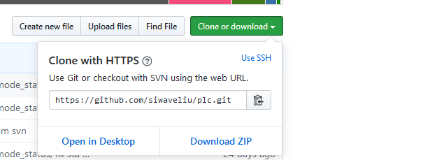

[toc]
# github.com上的操作
 - github官网注册账号
 - github上新建仓库
 - git上下载客户端
 
 # 本地pc上的操作
 - 安装客户端
 - git config --global user.name "name"
 - git config --global user.email "email@email.com"
 - ssh-keygen -t rsa 生成ssh key 在github.com-> settings->ssh 配置页面上添加new ssh

#常见的git命令
- mkdir test （创建文件夹test）
- cd test （切换到test目录）
- touch a.md （新建a.md文件）
- git status # 查看状态
- git init
- git push origin master(本地分支):master(远程分支) 表示将本地分支推送到远程分支 
- git push -u origin master 表示以后就用默认的远程库origin，并且访问的是master分支，后续只用git push就可以了
- git config -l #显示配置信息
- git config --global alias.xx yyyyy 之后就可以使用xx代替yyyyy

## 保存代码到临时区域
- git stash # 只要没有commit都可以使用

## 删除文件或者文件夹
- git --help 帮助命令
- git pull origin master 将远程仓库里面的项目拉下来
- dir  查看有哪些文件夹
- git rm -r --cached Photo\ albums  删除Photo albums文件夹(这里的文件夹名有空格命令行需要用"\ "来拼接）
- git commit -m '删除了Photo albums文件夹t'  提交,添加操作说明
- git push -u origin master 将本次更改更新到GitHub项目上去

## 忽略文件或文件夹
方法一（并不好用）

在git中如果想忽略掉某个文件，不让这个文件提交到版本库中，可以使用修改根目录中 .gitignore 文件的方法（如无，则需自己手工建立此文件）。这个文件每一行保存了一个匹配的规则例如：

\# 此为注释 – 将被 Git 忽略
 
\*.a       # 忽略所有 .a 结尾的文件
!lib.a    # 但 lib.a 除外
/TODO     # 仅仅忽略项目根目录下的 TODO 文件，不包括 subdir/TODO
build/    # 忽略 build/ 目录下的所有文件
doc/\*.txt # 会忽略 doc/notes.txt 但不包括 doc/server/arch.txt
规则很简单，不做过多解释，但是有时候在项目开发过程中，突然心血来潮想把某些目录或文件加入忽略规则，按照上述方法定义后发现并未生效，原因是.gitignore只能忽略那些原来没有被track的文件，如果某些文件已经被纳入了版本管理中，则修改.gitignore是无效的。那么解决方法就是先把本地缓存删除（改变成未track状态），然后再提交：

git rm -r --cached . （这里.可以换成你想忽视的文件，这样就能仅仅把想忽视的文件从本地缓存删除）
git add . （这里.可以换成你想忽视的文件+gitignore文件）
git commit -m 'update .gitignore'

\# 忽略*.o和*.a文件
 \*.\[oa]
\# 忽略*.b和*.B文件，my.b除外
\*.\[bB]
!my.b
\# 忽略dbg文件和dbg目录
dbg
\# 只忽略dbg目录，不忽略dbg文件
dbg/
\# 只忽略dbg文件，不忽略dbg目录
dbg
!dbg/
\# 只忽略当前目录下的dbg文件和目录，子目录的dbg不在忽略范围内
/dbg
\# 以'#'开始的行，被视为注释.
 * ？：代表任意的一个字符
    * ＊：代表任意数目的字符
    * {!ab}：必须不是此类型
    * {ab,bb,cx}：代表ab,bb,cx中任一类型即可
    * \[abc]：代表a,b,c中任一字符即可
    \*\[ ^abc]：代表必须不是a,b,c中任一字符
 
方法二（推荐）
在每个clone下来的仓库中手动设置不要检查特定文件的更改情况。
git update-index --assume-unchanged PATH 在PATH处输入要忽略的文件。

 

方法三

git 还提供了另一种 exclude 的方式来做同样的事情，不同的是 .gitignore 这个文件本身会提交到版本库中去。用来保存的是公共的需要排除的文件。而 .git/info/exclude 这里设置的则是你自己本地需要排除的文件。

# 问题
## fatal: refusing to merge unrelated histories 
- git pull origin master –allow-unrelated-histories
- git push <远程主机名> <本地分支名>:<远程分支名>  #也就是
- git push origin master:master  #提交成功。

# 一些特殊的命令
## 美化log显示
	git config --global alias.lg "log --graph --pretty=format:'%Cred%h%Creset -%C(yellow)%
	d%Creset %s %Cgreen(%cr) %C(bold blue)<%an>%Creset' --abbrev-commit --date=relative"
## 终端显示颜色分类
	git config --global color.ui true
## 终端显示中文文件名
	git config --global core.quotepath false

## 更换git的比较工具
	进入git bash
	cd ~
	vi .gitconfig
	输入下面语句
	[diff]
			tool = WinMerge
	[difftool "WinMerge"]
			cmd = "\"C:/Program Files/WinMerge/WinMergeU.exe\" \"$LOCAL\" \"$REMOTE\""
			
## 更改git的远程访问方式
	git remote -v # 查看远程访问方式
	git remote set-url origin XXX # XXX是ssh或者https链接，在github上的
## 设置代理访问
前提：socks5代理服务器，默认端口1080
设置SSH协议的代理

如果你的远程仓库拥有如下的格式：

git@github.com:archerie/learngit.git
ssh://git@github.com:archerie/learngit.git

那么，你使用的是SSH协议连接的远程仓库。因为git依赖ssh去连接，所以，我们需要配置ssh的socks5代理实现git的代理。在ssh的配置文件~/.ssh/config（没有则新建）使用ProxyCommand配置：

#Linux
Host bitbucket.org
  User git
  Port 22
  Hostname bitbucket.org
  ProxyCommand nc -x 127.0.0.1:1080 %h %p

#windows
Host bitbucket.org
  User git
  Port 22
  Hostname bitbucket.org
  ProxyCommand connect -S 127.0.0.1:1080 %h %p

如果你使用github，那么你只需要把bitbucket.org换成github.com就行了。具体配置的含义请参考ssh_config(5)。
设置http/https协议代理

如果你的远程仓库链接拥有如下格式：

http://github.com/archerie/learngit.git
https://github.com/archerie/learngit.git

说明你使用的是http/https协议，所以可以使用git配套的CMSSW支持的代理协议：SOCKS4、SOCKS5和HTTPS/HTTPS。可通过配置http.proxy配置：

### 全局设置
git config --global[local] http.proxy socks5://localhost:1080

### 本次设置
git clone https://github.com/example/example.git --config "http.proxy=127.0.0.1:1080"

这里演示的是socks5的配置，需要其他配置的可参考git-config配置中的http.proxy。
设置Git协议的代理

Git协议是Git提供的一个守护进程，它监听专门的端口（9418），然后提供类似于ssh协议一样的服务，只是它不需要验证。所以，然后用户通过网络都可以使用git协议连接提供git连接的仓库。如果远程仓库的链接是如下形式：

git://github.com/archerie/learngit.git

那么，该仓库使用git协议连接。所以，需要使用CMSSW提供的简单脚本去通过socks5代理访问：git-proxy。配置如下：

git config --global core.gitproxy "git-proxy"
git config --global socks.proxy "localhost:1080"
