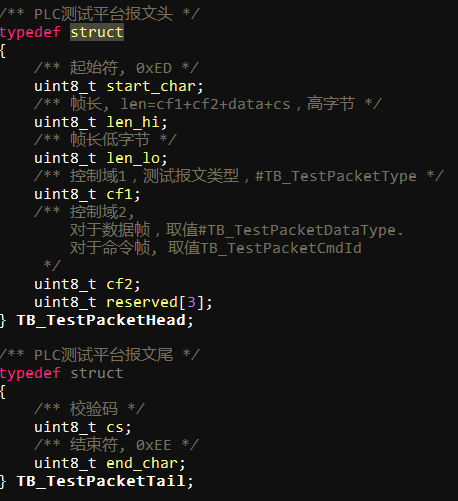

[toc!?direction=lr]

___

|修订内容|版本号|修订人|
|-|-|-|
初始未完成|0.1|刘博强
补充未完成项，增加生产ID写入流程；增加程序烧写流程；增加参数设置报文|0.2|刘博强
___

# 基本内容

## 名词解释
工装：测试板和测试夹具结合体，与pc通过uart相连
上位机：运行在pc上的控制程序，控制工装的测试流程。
标准模块：事先由矽久提供性能标准的模块，主要用来检验工装状态。
工装ID：每个工装使用前需要设置唯一的ID。
uart参数：*921600，N，8，1*（暂定）
模块标识符：模块烧写程序后产生，用于追溯模块生产流程。
报文：报文中的字段无特殊说明均为字节单位，即uint8，数据转换均为大端序列，例如uin16转为字节时 高字节在前，低字节在后。
## 测试目的和流程
为了HPLC载波模块生产后出厂质量检验而设立的测试系统。
每个模块测试发起是由两个条件，1、条形码扫码枪检测到条形码输入；2、工装上报模块插入报文
```flow!
st=>start: 开始
e=>end: 结束
op=>operation: 开始测试 
op1=>operation: 烧写程序传输
op2=>operation: 生产ID写入
op3=>operation: 版本号测试
op4=>operation: PIN和电压测试
op5=>operation: 功耗测试
op6=>operation: 通信测试
op7=>operation: 频偏测试
op8=>operation: 过零电路测试
op9=>operation: 停电上报测试
op10=>operation: 模块ID和芯片ID测试
cond=>condition: 正常 or 异常?
cond1=>condition: 等待条形码输入?
cond2=>condition: 等待插入模块，超时5s。

st->cond1
cond1(yes)->cond2->e
cond1(no)->cond1
cond2(yes)->op->op1->op2->op3->op4->op5->op6
cond2(no)->cond1
op6->op7->op8->op9->op10->e
```
## 协议报文结构
ED报文结构：head +data（u8的数组） +tail
head中包括 start_char(0xED) + length + cf+rsv
tail中包括 cs + end_char(0xEE)，cs是check_sum,(从cf开始到cs结束，不包括cs）。

>下行报文cf1=0x03，cf2=N；上位机发送给工装
上行报文cf1=0x83，cf2=N；工装发送给上位机
Cf1的第8bit表示方向，下行 bit=0，上行bit=1。

## 测试项命令
  cf=*0x03N*(cf1=0x03,cf2=**N**)  data=**X + DATA**
  **N:** 
1. 工装自检
2. 程序烧写[^1x]
[^1x]:如果已经烧写，那么无需启动
3.PIN和电压测试[^2x]
[^2x]:TXD/RXD/RST/EVENT/STA/1.2V/3.3V/12V-boost
4.  版本号测试
5.  通信测试[^3x]
[^3x]:包含接收SNR、平坦度、发送RSSI和通信成功率
6.  频偏测试
7.  功耗测试[^4x]
[^4x]:包括静态功耗和动态功耗
8.  过零电路测试
9.  停电上报测试
10. 模块ID和芯片ID写入校验[^5x]
11. 生产ID写入
[^5x]:暂不使用，单独流程
**X:** 01 启动 ，02 停止，03 结果
**DATA:** 依测试项不同而定
## 确认帧
所有指令应在100ms内回复，确认帧表示已经收到指令；同样的，当上位机软件收到工装上报的结果报文，也需要回复确认帧。
 cf=0x03CF data=0xFF 0xFF（异常数据 data = XX XX，后续定义）
 测试板回复：ED 00 08 83 CF 00 00 00 **FF FF** 00 EE （工装回复均为上行，最高bit置1）
上位机回复： ED 00 08 03 CF 00 00 00 **FF FF** 00 EE
工装无烧写程序: ED 00 08 03 CF 00 00 00 **00 01** 00 EE # 测试需要程序烧写，但是工装内存中无程序。

## 模块插入上报帧
模块插入后由工装上报给上位机，需要上位机回复确认帧，否则会不停上报
DATA区仅有一个字节FF
名称|帧内容
-|-
模块插入上报帧|ED 00 07 ==83 CC== 00 00 00  **{FF}(0)** 00 EE 

## 例子：
名称|帧内容（cs缺省为0）
---|---
启动工装自检| ED 00 07 ==03 01 #00BCD4== 00 00 00  ***{01}(X)*** 00 EE 
      回复         |ED 00 07 ==83 CF #00BCD4== 00 00 00 FF FF 00 EE
停止工装自检 |ED 00 07 ==03 01 #00BCD4== 00 00 00  ***{02}(X)*** 00 EE
       回复        |ED 00 07 ==83 CF #00BCD4== 00 00 00 FF FF 00 EE

---	
# 测试项
工装测试下位机程序会预置测试参数，但测试参数可能会失效（条件或者硬件更改），因此每次启动工装时需要下发各测试项参数。目前建议该流程放入工装自检中。
## 工装自检
原则上，每天**第一次**使用工装和工装连续使用**2000**次时都需要启动工装自检流程，以检验工装有效性。没有通过自检流程，则不允许生产。
### 流程
```flow!
st=>start: 开始
e=>end: 结束
op=>operation: 启动自检
op1=>operation: 工装回复确认
op2=>operation: 插入标准模块
op3=>operation: 工装自检
op4=>operation: 工装上报自检结果
op5=>operation: 上位机回复确认
op6=>operation: 上位机显示
op7=>operation: 设置测试项参数
cond=>condition: 正常 or 异常?

st->op7->op->op1->op2->op3->op4->op5->op6->cond
cond(yes)->e
cond(no)->op
```
### 交互报文
自检参数设置仅针对工装自检流程设计到的判断阈值设置，其它测试项需要单独设置参数。
阈值设定有范围的参数，min在前，max在后。
字节序号|0-3|4-7|8-11|12-15
|-|-|-|-|-|
0-15|TXD min/max@uint16|STA min/max@uint16|CAP min/max@uint16|1.2V min/max@uint16
字节序号|16-19|20-23|24|25-26
16-26|3.3V min/max@uint16|12V_boost min/max@uint16|版本号@uint8|衰减电路 min/max@uint8
字节序号|27-28|29-30|31-32
27-32|频偏测试 min/max@uint8|静态功耗 min/max@uint8|动态功耗 min/max@uint8
[**自检参数设置data区**]

字节序号|0|1|2|3
|-|-|-|-|-|
含义|总结果|PIN和电压|版本号|衰减电路
字节序号|4|5|6|7
含义|频偏测试|功耗测试|过零电路|停电上报
[**结果报文data区**]
每项占用一个字节，01表示pass；02表示fail；
 
名称|帧内容
-|-
启动自检|ED 00 07 ==03 01== 00 00 00  **{01}(X)** 00 EE 
停止自检 |ED 00 07 ==03 01== 00 00 00 **{02}(X)** 00 EE
工装上报结果|ED 00 0F ==83 01== 00 00 00 **{03}(X)** ***{02}(DATA:0) {01}(1) {01}(2) {01}(3) {01}(4) {02}(5) {01}(6) {01}(7)*** 00 EE 该条表示自检结果失败，其中功耗电路自检fail。
设置自检参数|ED 00 28 ==03 01== 00 00 00 **{04}(X)** ***{01}(DATA:0) {01}(1) {01}(2) {01}(3) {01}(4) {05}(5) {01}(6) {01}(7){05}(8) {05}(9) {01}(10) {02}(11) {01}(12) {01}(13) {01}(14) {01}(15) {01}(16) {05}(17) {01}(18) {01}(19){05}(20) {05}(21) {01}(22) {02}(23) {01}(24) {01}(25) {01}(26) {05}(27) {01}(28) {01}(29){05}(30) {05}(31) {01}(32)*** 00 EE

##  PIN和电压测试 
包含RXD/RST/EVENT/TXD/STA/1.2V/3.3V
其中TXD/STA/1.2V/3.3V会通过ADC来测量电平值
### 流程
```flow!
st=>start: 开始
e=>end: 结束
op=>operation: 启动PIN和电源电压测试
op1=>operation: 工装回复确认
op4=>operation: 工装上报信息
op5=>operation: 上位机回复确认
op6=>operation: 上位机判定并显示结果

st->op->op1->op4->op5->op6->e
```
### 交互报文
电平值使用2字节BCD码表示；高字节表示整数，低字节表示小数；如0x1189，表示为11.89V
字节序号|0-3|4-7|8-11|12-15
|-|-|-|-|-|
0-15|TXD min/max@uint16|STA min/max@uint16|3.3V min/max@uint16|1.2V min/max@uint16
[**参数设置data区**]
字节序号|0|1|2|3
|-|-|-|-|-|
含义|RXD结果|RST结果|EVENT结果|TXD结果
字节序号|4|5|6|7
含义|TXD_H|TXD_L|STA结果|STA_H
字节序号|8|9|10|11
含义|STA_L|12V结果|1.2_H|1.2_L
字节序号|12|13|14
含义|3.3V结果|3.3_H|3.3_L
[**结果报文data区**]

名称|帧内容
-|-
启动PIN和电压测试|ED 00 07 ==03 03== 00 00 00  **{01}(X)** 00 EE 
停止PIN和电压测试|ED 00 07 ==03 03== 00 00 00  **{02}(X)** 00 EE 
上报测试信息|ED 00 16 ==83 03== 00 00 00  **{03}(X)** ***{01}(DATA:0) {01}(1) {01}(2) {01}(3) {01}(4) {05}(5) {01}(6) {01}(7){05}(8) {05}(9) {01}(10) {02}(11) {51}(12) {01}(13) {01}(14)*** 00 EE
设置PIN和电压测试|ED 00 17 ==03 03== 00 00 00  **{04}(X)** ***{01}(DATA:0) {01}(1) {01}(2) {01}(3) {01}(4) {05}(5) {01}(6) {01}(7){05}(8) {05}(9) {01}(10) {02}(11) {01}(12) {01}(13) {01}(14) {01}(15)*** 00 EE 
## 版本号验证
从模块中读取**软硬件版本号**和预置值进行比较。
下发的启动测试帧中包含预置值的软件版本和硬件版本。
### 流程
```flow!
st=>start: 开始
e=>end: 结束
op=>operation: 启动版本号测试
op1=>operation: 工装回复确认
op4=>operation: 工装上报信息
op5=>operation: 上位机回复确认
op6=>operation: 上位机判定并显示结果

st->op->op1->op4->op5->op6->e
```

### 交互报文
字节序号|0|1|2|3
|-|-|-|-|-|
名称|软件版本高字节|软件版本低字节|硬件版本高字节|硬件版本低字节
[**版本号DATA区**]

名称|帧内容
-|-
启动版本号测试|ED 00 07 ==03 04== 00 00 00  **{01}(X)** 00 EE 
停止版本号测试|ED 00 07 ==03 04== 00 00 00  **{02}(X)** 00 EE 
版本号测试结果|ED 00 0B ==83 04== 00 00 00  **{03}(X)** ***{10 01}(软件版本) {20 01}(硬件版本)*** 00 EE  DATA区4个字节，大端显示格式。1001表示1.0.01软件版本，2001表示2.0.01硬件版本。
设置版本号测试|ED 00 0B ==03 04== 00 00 00  **{04}(X)** ***{10 01}(软件版本) {20 01}(硬件版本)*** 00 EE
## 通信测试
包含接收SNR、发送平坦度、发送RSSI和通信成功率
### 流程图
```flow!
st=>start: 开始
e=>end: 结束
op=>operation: 启动通信测试
op1=>operation: 工装回复确认
op4=>operation: 工装上报信息
op5=>operation: 上位机回复确认
op6=>operation: 上位机判定并显示结果

st->op->op1->op4->op5->op6->e
```
### 交互报文
SNR值类型int8；平坦度值类型32个int8；RSSI类型int16；通信成功率uint8
字节序号|0-1|2-65|66-69|70-71
|-|-|-|-|-|
0-71|SNR min/max@int8|平坦度 min/max@uint8 * 32|RSSI min/max@int16|COM_SUCC min/max@uint8
[**参数设置data区**]
字节序号|0|1|2|3~34
|-|-|-|-|-|
第一行|SNR结果|SNR值|平坦度结果|平坦度数值
字节序号|35|36|37|38
第二行|RSSI结果|RSSI高字节|RSSI低字节|通信成功率结果
字节序号|39
第三行|通信成功率值|
[**通信测试**]

名称|帧内容
-|-
启动通信测试|ED 00 07 ==03 05== 00 00 00  **{01}(X)** 00 EE 
停止通信测试|ED 00 07 ==03 05== 00 00 00  **{02}(X)** 00 EE 
通信测试结果|ED 00 2F ==83 05== 00 00 00  **{03}(X)** ***{01}(DATA:0) {30}(1) {01}(2) {03}(3) {04}(4) {05}(5) {6}(6) {07}(7){08}(8) {09}(9) {10}(10) {11}(11) {12}(12) {13}(13) {14}(14) {15}(15) {16}(16) {17}(17) {18}(18) {19}(19) {20}(20) {21}(21) {22}(22) {23}(23) {24}(24) {25}(25) {26}(26) {27}(27) {28}(28) {29}(29) {30}(30) {31}(31) {32}(32)  {33}(33)  {34}(34)  {02}(35) {00}(36) {52}(37) {01}(38) {64}(39)*** 00 EE
设置通信测试|ED 00 2F ==03 05== 00 00 00  **{04}(X)** ***{01}(DATA:0) {30}(1) {01}(2) {03}(3) {04}(4) {05}(5) {6}(6) {07}(7) {08}(8) {09}(9) {10}(10) {11}(11) {12}(12) {13}(13) {14}(14) {15}(15) {16}(16) {17}(17) {18}(18) {19}(19) {20}(20) {21}(21) {22}(22) {23}(23) {24}(24) {25}(25) {26}(26) {27}(27) {28}(28) {29}(29) {30}(30) {31}(31) {32}(32)  {33}(33)  {34}(34)  {02}(35) {00}(36) {52}(37) {01}(38) {64}(39) {30}(40) {01}(41) {03}(42) {04}(43) {05}(44) {6}(45) {07}(46) {08}(47) {09}(48) {10}(49) {11}(50) {12}(51) {13}(52) {14}(53) {15}(54) {16}(55) {17}(56) {18}(57) {19}(58) {20}(59) {21}(60) {22}(61) {23}(62) {24}(63) {25}(64) {26}(65) {27}(66) {28}(67) {29}(68) {30}(69) {31}(70) {32}(71)*** 00 EE

## 频偏测试
检查生产时模组的晶振频偏
### 流程图
```flow!
st=>start: 开始
e=>end: 结束
op=>operation: 启动频偏测试
op1=>operation: 工装回复确认
op4=>operation: 工装上报信息
op5=>operation: 上位机回复确认
op6=>operation: 上位机判定并显示结果

st->op->op1->op4->op5->op6->e
```
### 交互报文
字节序号|0-1
|-|-|
0-1|频偏阈值 min/max@int8
[**设置参数DATA区**]

字节序号|0|1-4|
|-|-|-|
0-4|结果|频偏值 @int32
[**结果报文DATA区**]

名称|帧内容
-|-
启动频偏测试|ED 00 07 ==03 06== 00 00 00  **{01}(X)** 00 EE 
停止频偏测试|ED 00 07 ==03 06== 00 00 00  **{02}(X)** 00 EE 
频偏测试结果|ED 00 0C ==83 06== 00 00 00  **{03}(X)** ***{01}(D:0) {FE FF FF FF}(int32)*** 00 EE  
设置频偏测试|ED 00 09 ==03 06== 00 00 00  **{04}(X)** ***{F8}(D:0) {14}(1)*** 00 EE

## 频偏测试
检查生产时模组的晶振频偏
### 流程图
```flow!
st=>start: 开始
e=>end: 结束
op=>operation: 启动频偏测试
op1=>operation: 工装回复确认
op4=>operation: 工装上报信息
op5=>operation: 上位机回复确认
op6=>operation: 上位机判定并显示结果

st->op->op1->op4->op5->op6->e
```
### 交互报文
|名称|列1
|-|-|
字节序号|0-1
0-1|频偏阈值 min/max@int8
[**设置参数DATA区**]

字节序号|0|1-4|
|-|-|-|
0-4|结果|频偏值 @int32
[**结果报文DATA区**]

名称|帧内容
-|-
启动频偏测试|ED 00 07 ==03 06== 00 00 00  **{01}(X)** 00 EE 
停止频偏测试|ED 00 07 ==03 06== 00 00 00  **{02}(X)** 00 EE 
频偏测试结果|ED 00 0C ==83 06== 00 00 00  **{03}(X)** ***{01}(D:0) {FE FF FF FF}(int32)*** 00 EE 
设置频偏测试|ED 00 09 ==03 06== 00 00 00  **{04}(X)** ***{F8}(D:0) {14}(1)*** 00 EE

## 功耗测试
检查模组的静态功耗和动态功耗是否合格
### 流程图
```flow!
st=>start: 开始
e=>end: 结束
op=>operation: 启动功耗测试
op1=>operation: 工装回复确认
op4=>operation: 工装上报信息
op5=>operation: 上位机回复确认
op6=>operation: 上位机判定并显示结果

st->op->op1->op4->op5->op6->e
```
### 交互报文
字节序号|0-1|2-3
|-|-|-|
0-3|静态功耗 min/max@uint8|动态功耗 min/max@uint8
[**设置参数DATA区**]

|名称|列1|列2|列3
|-|-|-|-|
字节序号|0|1|2|
0-2|结果|静态功耗 @uint8|动态功耗 @uint8
[**结果报文DATA区**]

名称|帧内容
-|-
启动功耗测试|ED 00 07 ==03 07== 00 00 00  **{01}(X)** 00 EE 
停止功耗测试|ED 00 07 ==03 07== 00 00 00  **{02}(X)** 00 EE 
功耗测试结果|ED 00 0A ==83 07== 00 00 00  **{03}(X)** ***{01}(D:0) {14}(1) {3C}(2)*** 00 EE
设置功耗测试|ED 00 0B ==03 07== 00 00 00  **{04}(X)** ***{00}(D:0) {01}(1) {02}(2) {03}(3)*** 00 EE

## 过零电路测试
检查模组过零电路功能是否正常
### 流程图
```flow!
st=>start: 开始
e=>end: 结束
op=>operation: 启动过零电路测试
op1=>operation: 工装回复确认
op4=>operation: 工装上报信息
op5=>operation: 上位机回复确认
op6=>operation: 上位机判定并显示结果

st->op->op1->op4->op5->op6->e
```
### 交互报文

字节序号|0
|-|-|
0|结果
[**结果报文DATA区**]

名称|帧内容
-|-
启动过零测试|ED 00 07 ==03 08== 00 00 00  **{01}(X)** 00 EE 
停止过零测试|ED 00 07 ==03 08== 00 00 00  **{02}(X)** 00 EE 
过零测试结果|ED 00 08 ==83 08== 00 00 00  **{03}(X)** ***{01}(D:0)*** 00 EE

## 停电上报测试
测试超级电容电路充放电功能，powerloss_pin和plug_pin是否有效
CAP_V/12_boost_V/POWERLOSS/PLUG
### 流程图
```flow!
st=>start: 开始
e=>end: 结束
op=>operation: 启动停电上报电路测试
op1=>operation: 工装回复确认
op4=>operation: 工装上报信息
op5=>operation: 上位机回复确认
op6=>operation: 上位机判定并显示结果

st->op->op1->op4->op5->op6->e
```
### 交互报文
字节序号|0-3|4-7
|-|-|-|
0-7|CAP_V min/max@uint16|12_boost_V min/max@uint16
[**设置参数DATA区**]
字节序号|0|1|2|3
|-|-|-|-|
0-3|总结果|POWERLOSS|PLUG|CAP_V结果|
字节序号|4-5|6|7-8
4-8|CAP_V值|12_boost_V结果|12_boost_V值
[**结果报文DATA区**]

名称|帧内容
-|-
启动停电上报测试|ED 00 07 ==03 0A== 00 00 00  **{01}(X)** 00 EE 
停止停电上报测试|ED 00 07 ==03 0A== 00 00 00  **{02}(X)** 00 EE 
停电上报测试结果|ED 00 10 ==83 0A== 00 00 00  **{03}(X)** ***{01}(D:0) {2}(1) {2}(2) {2}(3) {2}(4) {2}(5) {2}(6) {2}(7) {2}(8)*** 00 EE
停电上报测试设置|ED 00 0F ==83 0A== 00 00 00  **{03}(X)** ***{01}(D:0) {2}(1) {2}(2) {2}(3) {2}(4) {2}(5) {2}(6) {2}(7)*** 00 EE

## ID写入测试
需要写入模块ID、芯片ID和生产ID
### 流程图
```flow!
st=>start: 开始
e=>end: 结束
op=>operation: 启动ID写入测试
op1=>operation: 工装回复确认
op4=>operation: 工装上报信息
op5=>operation: 上位机回复确认
op6=>operation: 上位机判定并显示结果

st->op->op1->op4->op5->op6->e
```
### 交互报文
根据有效标记位来计算后面报文组成的长度，有效标记位不能省略
1=有效/成功
0=无效
2=失败 （仅结果上报报文使用，表示工装写入和读取的ID不一致）
字节序号|0|1|2|3-26|26-36|37-42|
|-|-|-|
0-42|芯片ID有效|模块ID有效|生产ID有效|芯片ID|模块ID|生产ID|
[**启动报文DATA区**]

字节序号|0|1|2|3-26|26-36
|-|-|-|-|-|-|
0-36|总结果|芯片ID结果|模块ID结果|芯片ID|模块ID
[**结果报文DATA区**]

名称|帧内容
-|-
启动ID写入测试|ED 00 2A ==03 0B== 00 00 00  **{01}(X)**  ***{01}(D:0) {00}(1) {01}(02) {02}(3) {02}(4) {02}(5) {2}(6) {2}(7) {2}(8) {2}(9) {2}(10) {2}(11) {2}(12) {2}(13) {2}(14) {2}(15) {2}(16) {2}(17) {2}(18) {2}(19) {2}(20) {2}(21) {2}(22) {2}(23) {2}(24) {2}(25) {2}(26) {2}(27) {2}(28) {2}(29) {2}(30) {2}(31) {2}(32) {2}(33) {2}(34)*** 00 EE  #此报文只有芯片ID和模块ID，生产ID省略
停止停电上报测试|ED 00 07 ==03 0B== 00 00 00  **{02}(X)** 00 EE 
停电上报测试结果|ED 00 10 ==83 0B== 00 00 00  **{03}(X)** ***{01}(D:0) {0}(1) {1}(2) {2}(3) {2}(4) {2}(5) {2}(6) {2}(7) {2}(8) {2}(9) {2}(10) {2}(11) {2}(12) {2}(13) {2}(14) {2}(15) {2}(16) {2}(17) {2}(18) {2}(19) {2}(20) {2}(21) {2}(22) {2}(23) {2}(24) {2}(25) {2}(26) {2}(27) {2}(28) {2}(29) {2}(30) {2}(31) {2}(32) {2}(33) {2}(34) {2}(35)*** 00 EE #返回的ID内容为工装发送命令帧让DUT写入后，再从DUT的flash中读取回来的结果

## 烧写程序传输
上位机需要给工装传输程序文件，该文件会在DUT每次开始测试时由工装自动烧写，也就是上位机在每次工装自检通过后发送一次文件传输，后续工装不断电就无需该流程。
默认工装测试都需要程序烧写，可以通过参数设置，告诉工装测试跳过程序烧写步骤。

启动报文携带待下发文件长，CRC32校验码。
crc32 polynomial = 0x04C11DB7; 初始值0xFFFFFFFF
每次报文传输data = 1k，最后一包<=1k。
### 流程图
```flow!
st=>start: 开始
e=>end: 结束
op=>operation: 启动程序传输测试
op1=>operation: 工装回复确认
co3=>condition: 工装上报信息 crc结果正确？
op5=>operation: 上位机回复确认
op6=>operation: 上位机判定并显示结果
op7=>operation: 报文序号+1
co=>condition: 工装回复确认？
co2=>condition: 传输文件报文，每帧最大重传次数为3,已经发送完?

st->op->op1->co2
co2(yes)->co3
co2(no)->co
co(yes)->op7->co2
co(no)->co2
co3(yes)->e
co3(no)->op
```
### 交互报文
字节序号|0-23|24-34
|-|-|-|
0-34|芯片ID|模块ID
[**启动报文DATA区**]

字节序号|0|1|2|3-26|26-36
|-|-|-|-|-|-|
0-36|总结果|芯片ID结果|模块ID结果|芯片ID|模块ID
[**结果报文DATA区**]

名称|帧内容
启动ID写入测试|ED 00 07 ==03 0B #00BCD4== 00 00 00  **{01}(X)**  ***{01}(D:0) {2}(1) {2}(2) {2}(3) {2}(4) {2}(5) {2}(6) {2}(7) {2}(8) {2}(9) {2}(10) {2}(11) {2}(12) {2}(13) {2}(14) {2}(15) {2}(16) {2}(17) {2}(18) {2}(19) {2}(20) {2}(21) {2}(22) {2}(23) {2}(24) {2}(25) {2}(26) {2}(27) {2}(28) {2}(29) {2}(30) {2}(31) {2}(32) {2}(33) {2}(34)*** 00 EE 
停止停电上报测试|ED 00 07 ==03 0B #00BCD4==00BCD4== 00 00 00  **{02}(X)** 00 EE 
停电上报测试结果|ED 00 10 ==83 0B #00BCD4== 00 00 00  **{03}(X)** ***{01}(D:0) {2}(1) {2}(2) {2}(3) {2}(4) {2}(5) {2}(6) {2}(7) {2}(8) {2}(9) {2}(10) {2}(11) {2}(12) {2}(13) {2}(14) {2}(15) {2}(16) {2}(17) {2}(18) {2}(19) {2}(20) {2}(21) {2}(22) {2}(23) {2}(24) {2}(25) {2}(26) {2}(27) {2}(28) {2}(29) {2}(30) {2}(31) {2}(32) {2}(33) {2}(34) {2}(35)*** 00 EE


