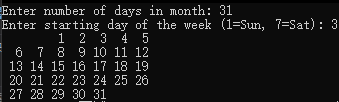

[toc!?direction=lr]

### 编程题
####
执行语句“ k=7>>1; ”后，变量 k 的当前值是
####
若有宏定义：#define MOD(x，y) x％y
则执行以下语句后的输出结果是
int a=13，b=94；
printf(″％d ″，MOD(b，a+4))；
#### 
```c?linenums
int f(char *s, char *t)
{
	char *p1, *p2;
	for(p1 = s; *p1; p1++)
	  for(p2 = t; *p2; p2++)
        if(*p1 == *p2) break;
	  if(*p2 == '\0') break;
	return p1 - s;
}
```
(a)f("abcd", "babc")的值是多少？
(b)f("abcd", "bcd")的值是多少？
(c)当传递两个字符串s和t时，函数f的返回值一般是什么？
####
####
堆和栈在内存中的区别是什么(数据结构方面以及内存方面)堆和树的区别；

####
编写一个程序，要求用户输入23小时制的时间，然后显示12小时制的格式：
Enter a 24-hour time: 21:11
Equivalent 12-hour time: 9:11 PM
####
编写程序显示单月的日历，用户指定这个月的天数和该月的起始日是星期几：
Enter numbler of days in month:31
Enter starting day of the week (1=Sun,7=Sat):3


####
（a）编写程序读一条消息，然后逆序打印出这条消息：
Enter a message: Don't get mad, get even.
Reversal is : .neve teg ,dam teg t 'noD
提示： 一次读取消息中的一个字符（用getchar函数），并且把这些字符存储在数组中，当数组满了或者读到字符‘\n’时停止读操作。

（b）修改上述程序， 用指针代替整数来跟踪数组中的当前位置。


